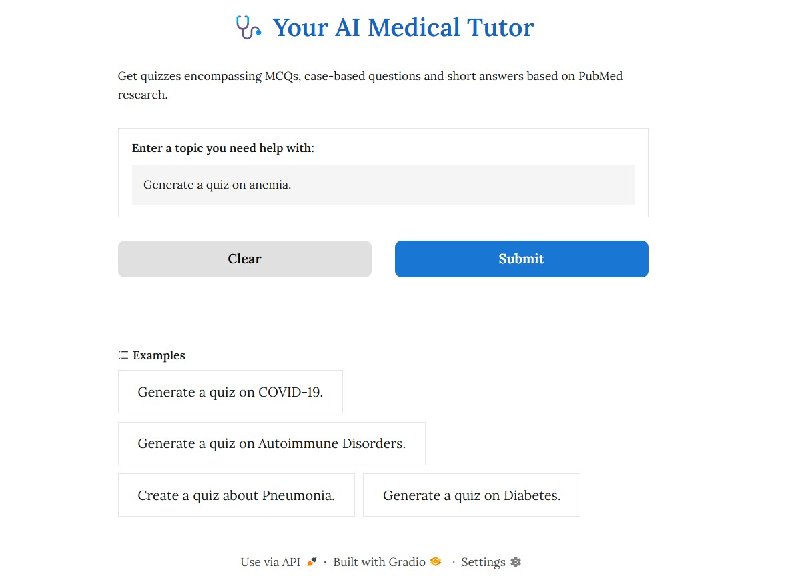
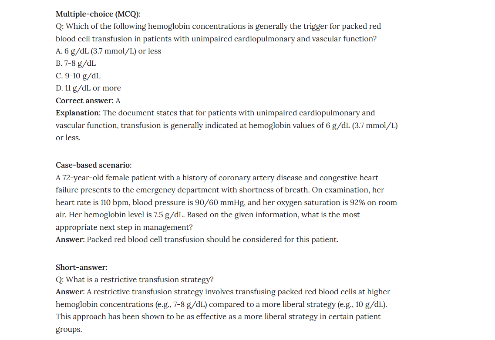

# Interactive AI-Powered Medical Learning Tool

This project demonstrates a modular, component-based pipeline for generating medical quizzes using large language models and current research literature. It uses the Haystack framework to connect PubMed article retrieval, prompt engineering, and LLM-based generation, all integrated into an interactive Gradio interface.

---

## Project Overview

- Custom Haystack pipeline fetches high quality medical articles from PubMed
- Prompts are dynamically built to support:
  - Multiple-choice questions (MCQs) with explanations
  - Case-based clinical scenario questions
  - Short-answer reasoning-based questions
- Uses Hugging Face's `Mixtral-8x7B-Instruct` model via inference API for generation
- Output is context-aware and grounded in actual medical literature
- Gradio interface supports real-time interaction and user-defined topics

---

## Technologies

- **Python**
- **Haystack** (pipeline, prompt builder, component system)
- **Gradio** (interactive UI)
- **pymed** (PubMed integration)
- **Hugging Face Inference API** (LLM-based quiz generation)

---

## Components

| Component            | Description                                                 |
|---------------------|-------------------------------------------------------------|
| `PubMedFetcher`      | Retrieves research abstracts from PubMed                   |
| `ArticleFormatter`   | Formats and passes structured content to the prompt builder |
| `PromptBuilder`      | Jinja-based templating for quiz generation prompts          |
| `HuggingFaceAPIGenerator` | Connects to LLMs via Hugging Face API              |
| `Gradio Interface`   | Provides an accessible front-end for testing and demo       |

---

## Screenshots

### Main Interface

### Example Output

